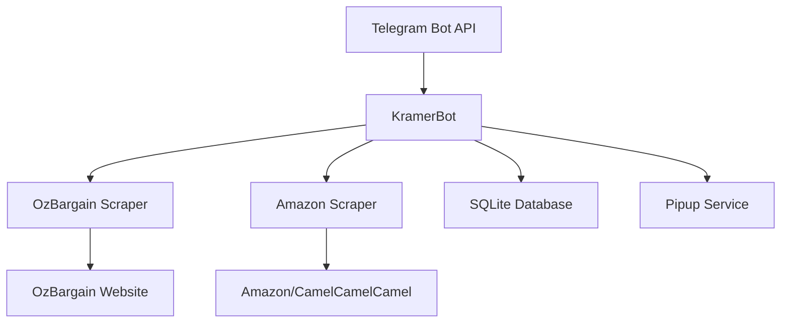
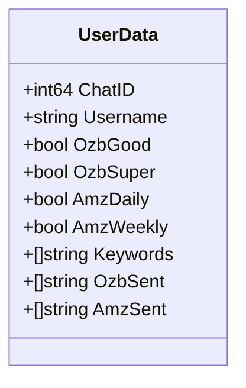
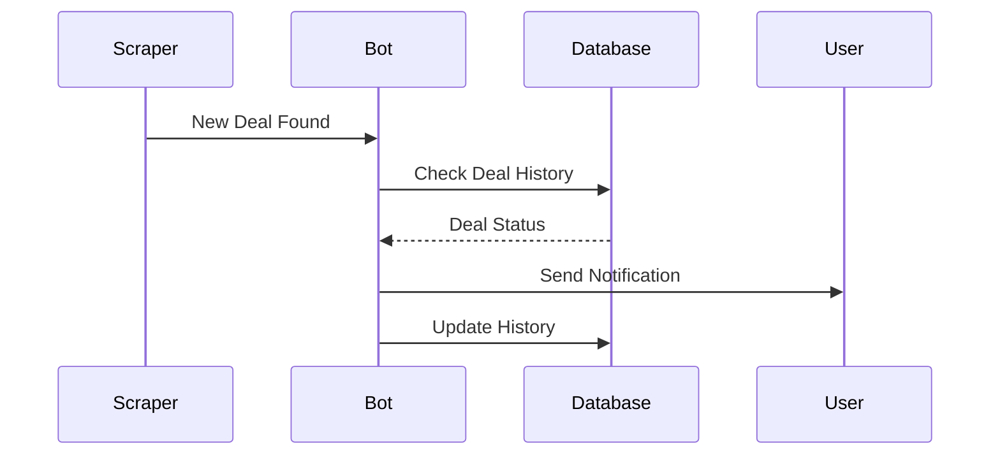

## Demo

A demo of the bot is running at [https://t.me/kramerbot](https://t.me/kramerbot).

## Overview

KramerBot is a Telegram bot designed to help users stay updated with the latest deals from popular websites like www.ozbargain.com.au and Amazon (via CamelCamelCamel). Named after the iconic character from Seinfeld, this bot acts as your personal deal hunter, constantly monitoring for the best bargains and notifying you instantly when they're found.

I wrote this bot to help me keep track of deals on OzBargain and Amazon. I was getting annoyed of checking the websites constantly and decided to write a bot that would do it for me.

## Key Features

The bot is built using Go and uses the Telegram Bot API to send messages to users. Some of its features are:

- **Real-time Deal Notifications**: Get instant updates about deals through Telegram
- **Multiple Deal Sources**:
  - OzBargain (Good deals with 25+ votes)
  - OzBargain (Super deals with 50+ votes)
  - Amazon Australia (Daily deals)
  - Amazon Australia (Weekly deals)
- **Custom Keyword Watchlists**: Set up personalized deal alerts based on keywords
- **Android TV Notifications**: Optional integration with Pipup for TV notifications
- **Admin Features**: Send announcements to all users, if you are an admin
- **SQLite Database**: Persistent storage of user preferences and deal history
- **Docker Support**: Easy deployment with containerization

## Architecture

The architecture of the bot and its main system components are shown in the diagram below:

### System Components



### Core Components

1. **Bot Core (`bot/`)**
   - Handles Telegram API interactions
   - Manages user commands and responses
   - Processes deal notifications

2. **Scrapers (`scrapers/`)**
   - OzBargainScraper: Monitors OzBargain deals
   - CamCamCamScraper: Tracks Amazon deals via CamelCamelCamel

3. **Data Models (`models/`)**
   - UserData: Stores user preferences and settings
   - Deal structures for different platforms
   - Notification configurations

4. **Persistence Layer**
   - SQLite database for user data
   - Deal history tracking
   - User preferences storage

## Design

The data model and the flow of the deal processing are shown in the diagrams below:

### User Data Model



### Deal Processing Flow



## Functionality

### User Commands

The bot supports the following commands:

1. **Basic Commands**
   - `/start` - Register or view status
   - `/help` - Show help message
   - `/preferences` - View current settings
   - `/test` - Send test notification

2. **Deal Type Toggles**
   - `/ozbgood` - Toggle OzBargain Good deals
   - `/ozbsuper` - Toggle OzBargain Super deals
   - `/amzdaily` - Toggle Amazon Daily deals
   - `/amzweekly` - Toggle Amazon Weekly deals

3. **Keyword Management**
   - `/addkeyword <keyword>` - Add keyword to watchlist
   - `/removekeyword <keyword>` - Remove keyword
   - `/listkeywords` - View current keywords

### Deal Processing

1. **Scraping**
   - Regular interval-based scraping
   - Configurable scrape intervals
   - Maximum deal storage limits
   - Duplicate detection

2. **Notification**
   - Instant Telegram notifications
   - Optional Android TV notifications
   - Deal history tracking
   - Custom formatting for different deal types

### Admin Features

- Send announcements to all users
- System status monitoring
- User management capabilities

## Deployment

### Requirements

- Go 1.18+
- SQLite3
- Telegram Bot Token
- (Optional) Pipup configuration for TV notifications

### Configuration

Primary configuration through `config.yaml`:
- Scraper intervals
- Logging settings
- Database paths
- Notification settings

Environment variables for sensitive data:
- `TELEGRAM_BOT_TOKEN`
- `KRAMERBOT_ADMIN_PASS`
- `SQLITE_DB_PATH`

### Docker Deployment

```bash
# Build
docker build -t kramerbot:latest .

# Run
docker run -d --name kramerbot \
  --env-file ./kramerbot.env \
  -v "$(pwd)/data:/app/data" \
  --restart unless-stopped \
  kramerbot:latest
```

## In the pipeline (and some ideas)

1. Web interface for user management
2. Additional deal sources
3. Advanced filtering options
4. Deal analytics and trends
5. User preferences synchronization
6. Enhanced admin dashboard

KramerBot provides a solution for deal hunters who want to stay updated with the latest bargains without constantly checking multiple websites. It has been designed to be modular and easy to extend. New websites can be added by implementing the `scraper` interface.

The project is open source and welcomes contributions from the community. 
